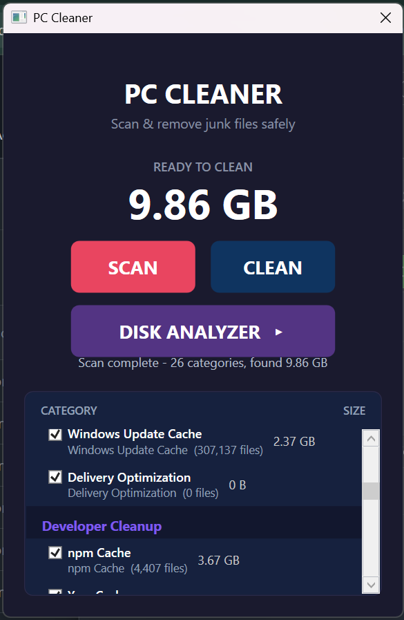
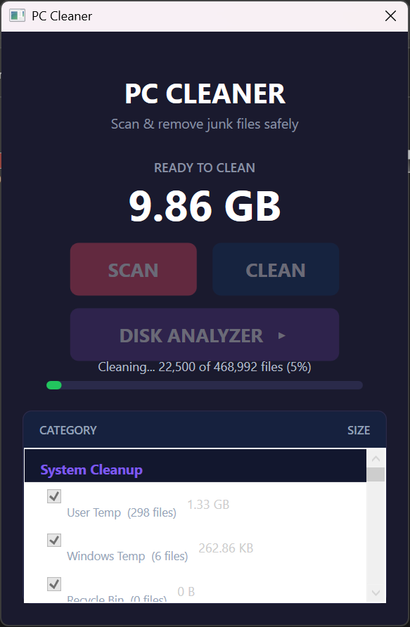
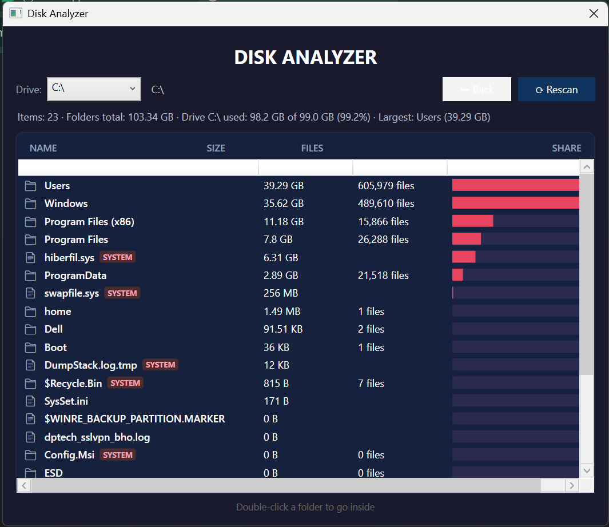
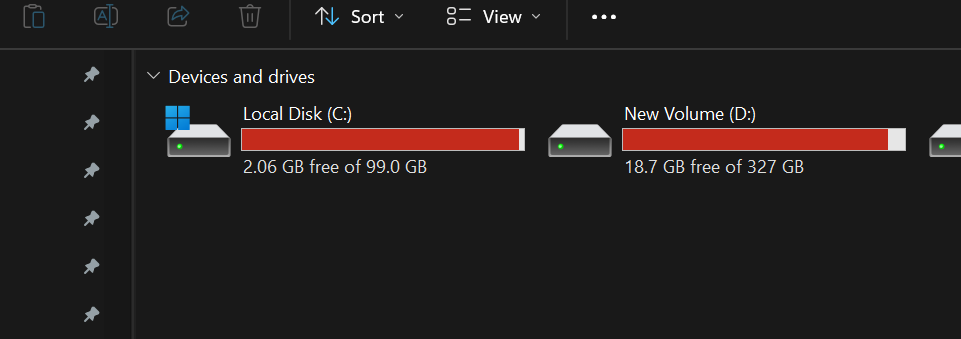
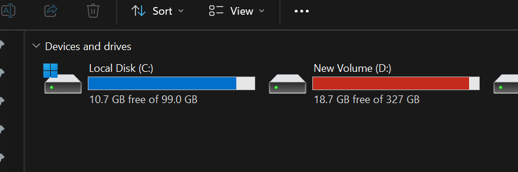

<div align="center">

# 🧹 PC Cleaner

**A developer-focused Windows junk cleaner built with C# / .NET 8 / WPF**

Scans, reports, and safely removes system and developer caches — so you always
know exactly what is eating your disk before you delete anything.

<p>
  
  
</p>
<p>
  
</p>


</div>

---

## 📸 Screenshots

| Scan Results | Cleaning Progress |
|---|---|
|  |  |
| **READY TO CLEAN 9.86 GB** — grouped categories (System / Developer) with per-category file counts | **Live progress bar** — `22,500 of 468,992 files (5%)`, controls lock during work |

<p align="center">
  
  <br><em>Disk Analyzer — recursive drill-down · <code>Used 98.2 of 99.0 GB (99.2%)</code> · <code>SYSTEM</code> tags · share bars</em>
</p>

---

## ⚡ Real Results — Before vs After

> My C: drive on a real machine — **8.6 GB recovered in one click**, no reinstall, no manual hunting.

<table>
<tr>
<td align="center" width="50%">

**🔴 Before**
<br><code>2.06 GB free of 99.0 GB</code>
<br><sub>97.9% used — almost full</sub>

</td>
<td align="center" width="50%">

**🟢 After**
<br><code>10.7 GB free of 99.0 GB</code>
<br><sub>89.2% used — breathing room</sub>

</td>
</tr>
<tr>
<td align="center">



</td>
<td align="center">



</td>
</tr>
<tr>
<td colspan="2" align="center">

**✨ Freed ~8.64 GB** &nbsp;·&nbsp; red → blue &nbsp;·&nbsp; `Local Disk (C:)` · Explorer `Devices and drives`

</td>
</tr>
</table>

<p align="center">
  <em>Left: before clean (red, nearly full) · Right: after clean (blue, 10.7 GB free) — same PC, same C: drive.</em>
</p>

---

## ✨ Features

### System Cleanup
- **User Temp** & **Windows Temp**
- **Recycle Bin** (all fixed drives)
- **Thumbnail Cache** & **Icon Cache**
- **Crash Dumps** (local + minidump + MEMORY.DMP)
- **Windows Update Cache** & **Delivery Optimization**

### Developer Cleanup
- **npm Cache** · **Yarn Cache** · **Composer Cache** · **pnpm Cache** · **Bun Cache** · **pip Cache**
- **Gradle Cache** (dependencies + downloaded Gradle dists) & **NuGet HTTP Cache** & **Maven Wrapper Cache**
- **Flutter Pub Cache** (re-resolved by `flutter pub get`)
- **Android Studio / JetBrains IDE Caches** (caches + logs, all installed products)
- **VS Code Cache** (Cache / CachedData / Code Cache / GPUCache / logs)
- **AI Model Cache (Hugging Face)** — re-downloadable models/blobs (⚠ off by default;
  chat & session history is always preserved)
- **Playwright Browsers** (⚠ re-downloaded on next run, off by default)
- **Chrome & Edge** caches across *all* profiles (`Cache`, `Code Cache`, `GPUCache`) — bookmarks, history, cookies and passwords are never touched

### Application Cleanup
- **Microsoft Teams** (Cache / Code Cache / GPUCache / blob_storage / logs)
- **Slack** · **Discord** caches — chat history and signed-in data are never touched

### Disk Analyzer
- Drive-level folder size breakdown with recursive drill-down
- Live drive usage context (`used 95.7 of 100 GB`)
- Protected system files (`hiberfil.sys`, `pagefile.sys`, …) clearly tagged `SYSTEM`

<p align="center">
  
  <br><em>Example: C:\ breakdown — double-click any folder to drill down</em>
</p>

### Safety & Experience
- **Scan first, delete second** — two-step flow with per-category selection
- Live **progress bar** while scanning and cleaning; all controls lock during work
- Admin elevation requested only when needed (Windows Temp, Windows Update, Delivery Optimization)
- Grouped results: **System Cleanup** / **Developer Cleanup** / **Application Caches** with live "ready to clean" total
- Detailed cleaning report (deleted / skipped / reasons)

---

## 🚀 Getting Started

### Prerequisites
- [.NET SDK 8.0](https://dotnet.microsoft.com/download/dotnet/8.0) (`net8.0-windows`)
- Windows 10/11 (x64)
- Optional: [Inno Setup 6](https://jrsoftware.org/isinfo.php) to build the installer

### Build & run
```bash
git clone <repo-url>
cd PC-Cleaner
dotnet restore
dotnet build -c Release
dotnet run --project src/PcCleaner.App
```

### Run the tests
```bash
dotnet test
```
> 43 unit tests cover the domain model, safety checks, cleaning engine,
> scanners (incl. all-profile browser discovery), the disk analyzer, and
> progress reporting.

### Build the installer (optional)
```powershell
# 1a. Self-contained (no .NET needed on target PC, recommended for WhatsApp, ~48 MB installer)
dotnet publish src/PcCleaner.App -c Release -r win-x64 --self-contained true -o src/PcCleaner.App/bin/Release/net8.0-windows/publish

# 1b. Framework-dependent (needs .NET 8 Desktop Runtime, ~2 MB installer)
dotnet publish src/PcCleaner.App -c Release -r win-x64 --self-contained false -o src/PcCleaner.App/bin/Release/net8.0-windows/publish

# 2. Compile the install script
& "$env:LOCALAPPDATA\Programs\Inno Setup 6\ISCC.exe" installer/pc-cleaner.iss
# or: & "C:\Users\$env:USERNAME\AppData\Local\Programs\Inno Setup 6\ISCC.exe" installer/pc-cleaner.iss
```
Output: `installer/PC-Cleaner-Setup.exe` (self-contained 48.82 MB) / `PC-Cleaner-Setup-Framework.exe` (2.21 MB)

### 📥 Install from WhatsApp (no SDK needed)
Share `installer/PC-Cleaner-v1.0.0-WhatsApp.zip` (48.3 MB, contains `PC-Cleaner-Setup.exe` + `README-INSTALL.txt`) — receiver just downloads, extracts, double-clicks.
- If browser says `blocked`: `... → Keep → Keep anyway` (ZIP avoids this).
- Right-click exe → `Properties → Unblock → Apply` (or `Unblock-File` in PowerShell).
- Double-click → `Yes (UAC)` → `More info → Run anyway` (unsigned, first time only) → Next → Install.
- If Defender quarantines: `Windows Security → Protection history → Allow → Restore`.

> See `installer/INSTALL-GUIDE.txt` for receiver instructions. Signed build via SignPath (free for OSS) pending — see `SIGNPATH-APPLY-GUIDE.md`.

---

## 🏗 Architecture

Clean layered architecture — `App → Infrastructure → Domain` and `App → Application → Domain`.

```
src/
├── PcCleaner.Domain        # Models, enums, interfaces (zero dependencies)
├── PcCleaner.Application   # Services & app-level contracts (IScanService, progress)
├── PcCleaner.Infrastructure# Scanners, cleaning engine, disk analyzer, admin helper
└── PcCleaner.App           # WPF UI + dependency injection + Serilog wiring
tests/
└── PcCleaner.UnitTests     # xUnit test suite
```

### Key invariants
- Every scanner implements `IScanner` (`Name`, `Type`, `RequiresAdmin`, `ScanAsync`)
- All deletion funnels through the shared `CleaningEngine` (`ICleaner`) with reason-aware error handling (access denied / in use / not found)
- Progress is reported via `IProgress<T>` (`ScanProgress`, `CleanUpProgress`) so the UI never freezes
- Deletion is always explicit: items are scanned first, shown to the user, then deleted — **never** blindly

### Logging
Serilog file sink → `%LOCALAPPDATA%\PC-Cleaner\logs\cleaner-YYYYMMDD.log` (7-day retention).

---

## 💻 How to use

1. Click **SCAN** — categories are scanned with live progress

2. Review the grouped results and uncheck anything you want to keep
   (Playwright is off by default)

   <p align="center">
     
     <br><em>Scan complete — 26 categories, found 9.86 GB. Uncheck to keep, check to clean.</em>
   </p>

3. Click **CLEAN** — confirm, and watch the progress bar

   <p align="center">
     
     <br><em>Live progress — controls lock until cleaning finishes, then detailed report.</em>
   </p>

4. Use **DISK ANALYZER ▸** to hunt down the largest folders on any drive
   — see [Screenshots](#-screenshots) for the full drive breakdown

5. Done — click **SCAN** again to rescan

   <p align="center">
     
     
     <br><em>Result on my C: drive — 2.06 GB → 10.7 GB free (8.6 GB recovered). See <a href="#-real-results--before-vs-after">Before vs After</a>.</em>
   </p>

> **Note:** cleaning intents that require admin rights (Windows Temp / Update /
> Delivery Optimization) will prompt to restart as administrator. Choose **No**
> to clean only the non-admin categories.

---

## 🤝 Contributing

1. Fork the repository
2. Follow the existing scanner pattern (see `Infrastructure/Scanners`)
3. Cover new behavior with a unit test (temp-dir fixtures, like the existing suite)
4. `dotnet build` and `dotnet test` must stay green
5. Open a pull request

---

## 🗺 Roadmap

- Docker cleanup (build cache, unused images/containers) via CLI
- WiX / System Cleanup integration (DISM WinSxS, `cleanmgr` for Windows.old)
- Stopwatch & space-recovered history dashboard
